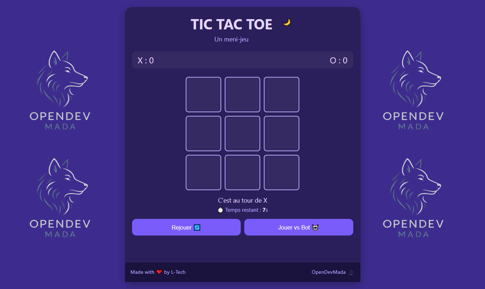
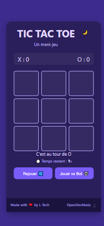

# 🎮 TIC TAC TOE - Défi 5 | OpenDev Mada




Un mini-jeu classique revisité avec style, dans le cadre du 5ème défi **OpenDev Mada**.  
Développé avec ❤️ par **RADIMSON Landrosse**, alias **L-Tech**.

---

## 🧠 À propos du projet

Tic Tac Toe est un jeu simple mais stratégique où deux joueurs (X et O) s'affrontent pour aligner trois symboles horizontalement, verticalement ou en diagonale.

Cette version propose :

- 🎨 Une interface **responsive** et **moderne**
- 🤖 Un mode **vs Bot** automatisé
- ⏱️ Un **chrono** par tour pour corser la partie
- 🌙 Un **mode nuit** avec toggle de thème
- 🔊 Des **effets sonores** pour plus de fun

---

## 📁 Fonctionnalités

- 🧩 Grille 3x3 dynamique
- 🤝 Mode 2 joueurs ou contre l'IA
- 📈 Système de score pour X et O
- 🕹️ Redémarrage de partie à tout moment
- 💡 Indications de tour et statut
- 📱 Compatible mobile / tablette / desktop

---

## 🧪 Technologies utilisées

- HTML5
- CSS3 (Custom Properties + Responsive Design)
- JavaScript (ES6+, sans point-virgule 🧪)
- Aucun framework externe (pur et optimisé)

---

## 🚀 Lancer le projet

1. Clone ce repo :

```bash
git clone https://github.com/landrosdev/tic_tac_toe.git
